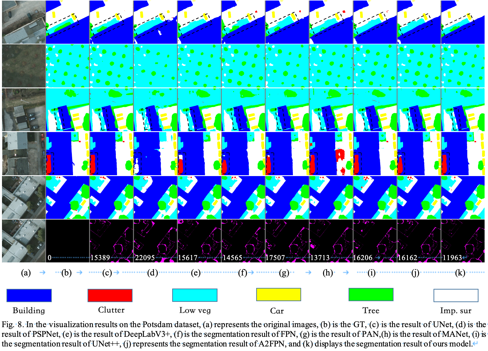

# ABCFNet: Boundary-Enhanced and Dimension Cross Attention Network for Segmentation of Remote Sensing Images


In this repository, a novel network model ABCFNet is proposed to solve the problems of boundary information loss, lack of detail information, lack of multi-scale features and difficulty of small target recognition in remote sensing image feature extraction.


## Requirements：

```
numpy >= 1.24.3
Pytorch >= 1.12.1
Python >= 3.8
cuda >= 11.7.1
```


## Dataset：

Data sets are available from https://www.isprs.org/education/benchmarks/UrbanSemLab/2d-sem-label-potsdam.aspx


## Results of visualization

#### Visualization of the potsdam datasets




#### Visualization of the Vaihingen datasets


#### Visualization of heatmaps


#### Visualization of Boundary


